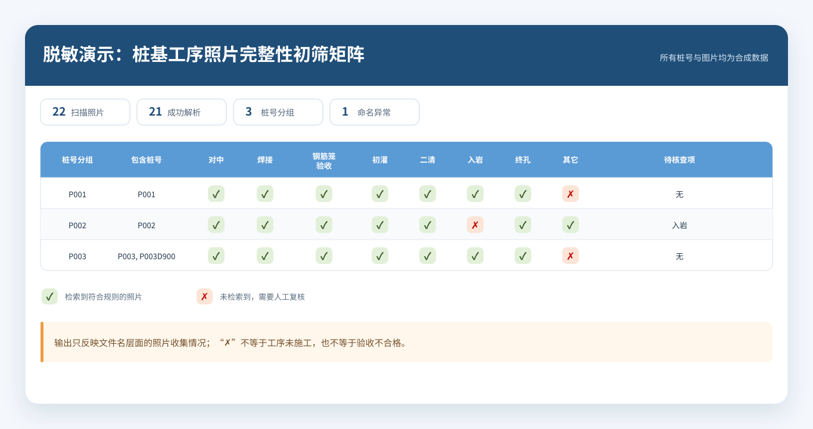

# 桩基工序照片完整性初筛工具

> 将按约定命名的桩基工序照片，自动整理为“桩号 × 工序”Excel 矩阵，帮助项目人员快速定位待复核项。


## 30 秒看懂

| 现场问题 | 解决方式 | 结果 |
|---|---|---|
| 上千张工序照片分散在多层文件夹，人工逐张检索容易遗漏 | 解析照片文件名中的桩号与工序，统一命名变体并合并派生桩号 | 自动生成可筛选的“桩号 × 工序”Excel 矩阵，以 ✓/✗ 标记已检索到与待核查项 |

真实项目中，本工具曾对约 1500 张照片进行批量统计，结果整理为覆盖 130+ 桩号的 Excel/PDF，并提交项目群用于阶段性资料自查。

本仓库是面向求职展示的脱敏重构版：代码保留核心业务规则，数据、截图和输出均为合成内容，不含真实工程资料。

## 它解决了什么

原流程需要在“日期文件夹 → 桩号文件夹 → 照片”中逐层查找，再手工维护台账。这个工具将过程改为：

```text
照片目录 → 文件名解析 → 工序归一 → 桩号合并 → Excel 完整性矩阵 → 人工复核
```

输出中的 `✓` 表示检索到符合命名规则的照片，`✗` 表示未检索到、需要人工确认。它不判断照片内容、施工质量或验收结论。

## 演示结果



合成样例包含 22 张占位图片，覆盖：完整桩号、缺失工序、别名归一、带编号变体、`D` 后缀桩号合并和异常命名。

可直接下载查看：[脱敏演示 Excel](examples/demo_output/pile_photo_completeness.xlsx) · [文本报告](examples/demo_output/pile_photo_completeness.txt)

## 我的职责

- 识别现场照片资料依赖人工检索、核查路径长的问题；
- 梳理“文件夹—桩号—工序—文件名”解析链路；
- 定义工序归一、相似桩号合并、非标准项归类及异常命名规则；
- 使用 AI 辅助完成代码实现，并负责结果核验、报表整理和项目内提交；
- 在公开版本中补充参数化、异常清单、合成演示数据和自动化测试。

更完整的需求拆解与证据边界见：[项目案例说明](docs/case-study.md)。

## 关键业务规则

| 规则 | 示例 | 处理结果 |
|---|---|---|
| 首个汉字切分桩号与工序 | `P018钢筋笼验收.jpg` | 桩号 `P018`，工序 `钢筋笼验收` |
| 工序别名归一 | `钢筋笼焊接` | `焊接` |
| 带编号工序归一 | `焊接1` | `焊接` |
| 派生桩号合并 | `P003`、`P003D900` | 归入 `P003` 分组 |
| 非标准工序归类 | `旁站记录` | `其它` |
| 异常命名显式暴露 | `现场照片.jpg` | 跳过解析并列入异常清单 |

标准工序：对中、焊接、钢筋笼验收、初灌、二清、入岩、终孔。

## 快速体验

环境要求：Python 3.10+。

```bash
git clone https://github.com/0807jinhao-sudo/pile-photo-completeness-checker.git
cd pile-photo-completeness-checker
python -m pip install -r requirements.txt
python scripts/create_demo_data.py
python pile_photo_checker.py examples/demo_input --output examples/demo_output
```

Windows 用户也可以安装依赖后双击 `run_demo.bat`。

程序会生成：

- `pile_photo_completeness.xlsx`：核查矩阵、命名异常、使用说明；
- `pile_photo_completeness.txt`：便于快速查看的文本报告。

## 使用自己的目录

目录结构：

```text
照片根目录/
├── 2025-10-20/
│   ├── P001/
│   │   ├── P001对中.jpg
│   │   ├── P001钢筋笼焊接.jpg
│   │   └── P001终孔.jpg
```

运行：

```bash
python pile_photo_checker.py "照片根目录" --output "结果目录"
```

支持 `.jpg`、`.jpeg`、`.png`、`.bmp`。

## 测试

```bash
python -m unittest discover -s tests -v
```

测试覆盖文件名解析、工序归一、异常命名、`D` 后缀合并及 Excel/TXT 输出。

## 项目结构

```text
pile-photo-completeness-checker/
├── pile_photo_checker.py        # 主程序
├── scripts/create_demo_data.py  # 合成演示数据
├── examples/                    # 脱敏输入说明与示例输出
├── tests/                       # 业务规则与集成测试
└── docs/                        # 案例、边界和展示素材
```

## 技术说明与限制

- Python + openpyxl；
- 只读取目录结构和文件名，不读取照片画面；
- 规则依赖前置命名规范，异常文件需要人工处理；
- 工具定位是资料完整性初筛，不替代施工验收或质量判断；
- 真实应用、脱敏范围和 AI 辅助说明见：[脱敏与真实性边界](docs/privacy-and-boundaries.md)。
