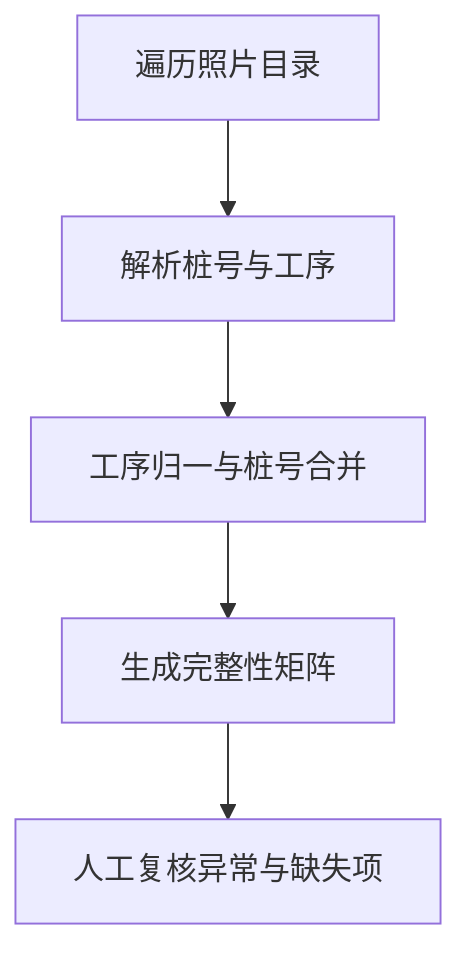

# 项目案例：把照片文件夹转化为可复核的工序矩阵

## 项目定位

这是一个源于施工现场真实资料管理问题的小型业务数字化工具。它把照片文件名中的桩号和工序信息结构化，自动生成“桩号 × 工序”Excel 矩阵，用于阶段性资料完整性初筛。

项目角色：需求分析 / 业务规则设计 / AI 辅助开发。

## 1. 业务背景

桩基施工会持续产生多类工序照片。照片数量增加后，人工逐张检索并维护 Excel 台账容易出现三个问题：

1. 核查路径长：需要在多层文件夹中反复查找；
2. 命名存在变体：同一工序可能出现别名或编号后缀；
3. 桩号存在派生后缀：若不合并，会把同一基础桩号拆成多行。

因此，核心需求不是“识别照片内容”，而是先把已有照片清单转化为可扫描、可复核的结构化矩阵。

## 2. 需求拆解

| 优先级 | 需求 | 验收方式 |
|---|---|---|
| P0 | 批量扫描指定目录中的常见图片格式 | 统计数量与目录内候选图片一致 |
| P0 | 从文件名拆分桩号与工序 | 对符合/不符合规则的样例分别验证 |
| P0 | 统一工序名称 | “钢筋笼焊接”归一为“焊接”，带编号变体可识别 |
| P0 | 合并带 `D` 后缀的桩号 | `P003` 与 `P003D900` 汇总到同一基础桩号 |
| P0 | 输出“桩号 × 工序”矩阵 | Excel 中以 ✓/✗ 展示已检索到与待核查项 |
| P1 | 暴露异常命名 | 无法解析的文件单独列出，不静默丢失 |
| P1 | 明确结果边界 | 报告中提示“未检索到”不等于“未施工” |

## 3. 规则设计

### 文件夹结构

```text
输入目录/
├── 日期文件夹/
│   ├── 桩号文件夹/
│   │   ├── 桩号工序.jpg
```

### 文件名解析

- 文件名必须以英文字母或数字开头；
- 首个汉字左侧识别为桩号；
- 首个汉字及其右侧识别为工序；
- 不符合规则的文件进入“命名异常”清单。

### 工序归一

标准工序为：对中、焊接、钢筋笼验收、初灌、二清、入岩、终孔。

- `钢筋笼焊接` → `焊接`；
- `焊接1` 等包含标准关键词的变体 → `焊接`；
- 不能归入标准工序的名称 → `其它`。

### 桩号合并

按首个大写字母 `D` 左侧内容生成基础分组键。例如：

```text
P003       ┐
           ├── P003
P003D900   ┘
```

## 4. 处理流程



## 5. 输出与实际应用边界

原项目的一次运行记录显示扫描约 1500 张照片并形成 130+ 个桩号统计项；随后将整理后的 Excel/PDF 结果提交项目群，用于阶段性资料自查。

现有材料能够证明：

- 代码真实存在并执行过；
- 有运行记录、Excel/PDF 结果和一次项目群提交记录；
- 完成了“问题识别 → 规则梳理 → 自动输出 → 人工整理 → 提交核查”的闭环。

现有材料不能证明：

- 工具已成为正式生产系统；
- 结果达到某个未经测试的准确率；
- 团队成员持续使用或形成大规模推广；
- ✓/✗ 可以替代施工质量判断或验收结论。

## 6. 公开演示版做了什么整理

- 移除本机路径和真实工程路径，改为命令行参数；
- 不复制旧 Git 历史，不公开真实照片、桩号、群聊或原始报表；
- 增加合成演示数据生成脚本；
- 增加异常命名清单、结果边界提示和基础测试；
- 优化 Excel 的筛选、冻结窗格、配色与阅读顺序；
- 保留原始业务规则，但不把公开重构包装成历史上已上线的功能。

## 7. 复盘

这个项目的核心价值并不是代码规模，而是把现场人员默认掌握的隐性规则转化为显式规则，再用结构化输出降低人工检索成本。对需求分析/B 端产品岗位而言，它展示的是：发现问题、澄清口径、定义边界、处理异常和交付可复核结果的能力。
